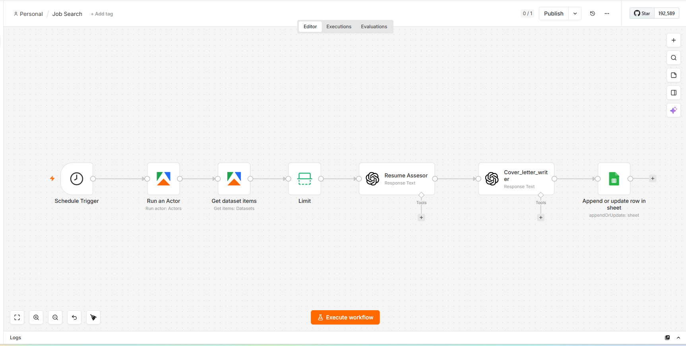

# Job Search Automation with n8n



An automated job search pipeline built with n8n that scrapes Data Engineer listings from Indeed Netherlands, scores each role against a candidate profile using an LLM, generates tailored cover letters, and stores everything in a Google Sheets tracker.

---

## Business Problem

Searching and applying for jobs manually is repetitive and time-consuming.

Candidates often spend hours:

- Searching multiple job boards
- Evaluating role suitability
- Writing customised cover letters
- Tracking applications

This project automates the entire process by discovering jobs, evaluating fit using AI, generating tailored application content, and maintaining a centralised application tracker.

---

## Key Features

- Automated daily job discovery
- AI-powered resume matching
- Structured job scoring system
- Automatic identification of Dutch-language-required roles
- Tailored ATS-friendly cover letter generation
- Google Sheets application tracking
- Duplicate prevention using job URL matching
- Fully automated scheduled execution

---

## Architecture

The solution combines workflow automation, web scraping, large language models, and cloud-based tracking.

```text
Schedule Trigger
      ↓
Apify Indeed Scraper
      ↓
Dataset Retrieval
      ↓
Resume Assessor (LLM)
      ↓
Cover Letter Generator (LLM)
      ↓
Google Sheets Tracker
```

---

## Results

The automation reduces the manual effort required for job searching by:

- Automatically discovering relevant opportunities
- Eliminating manual job screening
- Generating personalised cover letters at scale
- Maintaining a structured application database
- Enabling daily unattended execution

---

## Tech Stack

| Category | Technology |
|----------|------------|
| Workflow Orchestration | n8n |
| Job Scraping | Apify Indeed Scraper |
| AI Models | OpenAI GPT-5 Mini |
| Data Storage | Google Sheets |
| Scheduling | n8n Schedule Trigger |
| Prompt Engineering | Custom LLM Prompts |
| Automation | n8n Cloud |

---

## Future Enhancements

- LinkedIn Jobs integration
- Automatic application submission
- Multiple candidate profile support
- Email notifications for high-scoring jobs
- PostgreSQL or Snowflake storage instead of Google Sheets
- Dashboarding using Power BI
- Automatic company research and enrichment
- Multi-country job search support
- Score threshold filtering before cover letter generation
